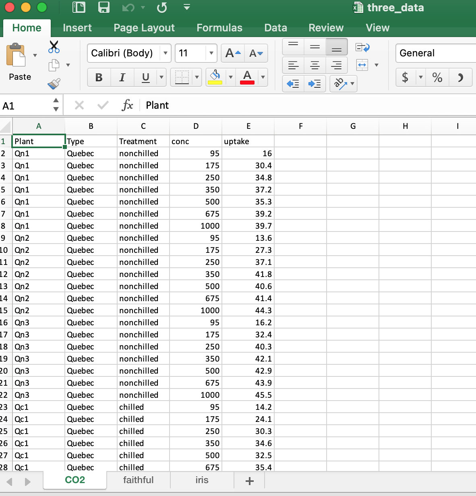

Get open xlsx package
```{r}
if(!require(openxlsx)) install.packages("openxlsx", repos = "http://cran.us.r-project.org")
```

Get 3 sample datasets to write into 1 excel document. 1 dataset per excel tab.
```{r}
data("faithful")
head(faithful)

data("iris")
head(iris)

data("CO2")
head(CO2)
```

Put all 3 datasets into a list.
```{r}
all <- list("CO2" = CO2, "faithful" = faithful, "iris" = iris)
```

Write each dataset to its own tab
```{r}
write.xlsx(all, "three_data.xlsx")
```



